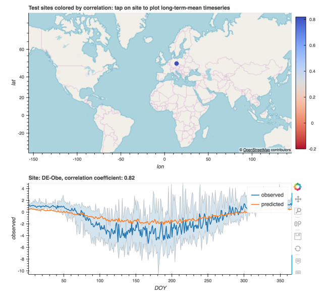
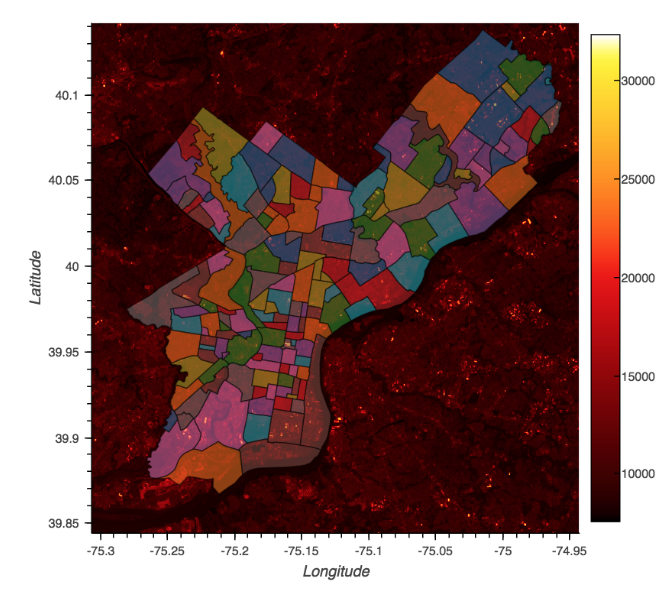
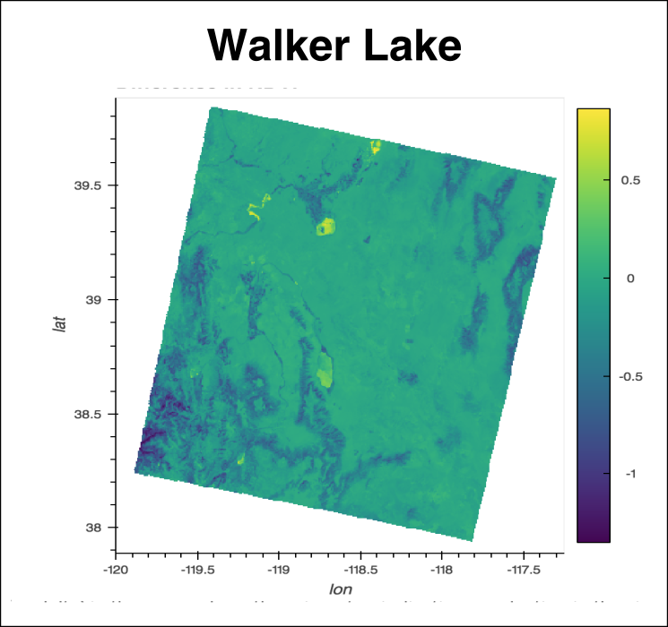
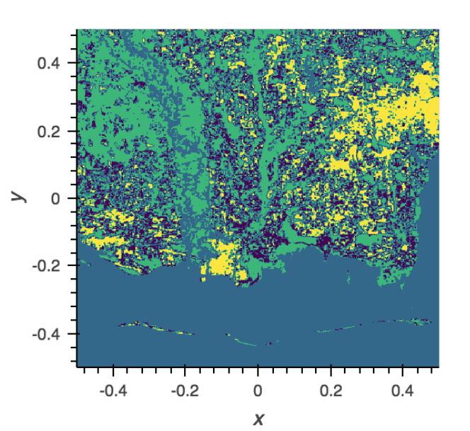

> # ⚠️ <strong>IMPORTANT NOTICE</strong> ⚠️ 
> This site is <strong>ARCHIVED</strong> and will <strong>NO LONGER BE UPDATED</strong>. 
> For updated Tutorial material, please visit the <a href="https://projectpythia.org/landsat-ml-cookbook/README.html" style="color: #812fd3;">Pythia landsat-ml cookbook</a>. 
> For Topic Examples, head over to the <a href="https://examples.holoviz.org/" style="color: #812fd3;">HoloViz Examples</a> website.

# EarthML

**Machine learning and visualization in Python for Earth science**

EarthML is a "meta-project" with the aim of improving, documenting,
and illustrating how to use other, freely available, general-purpose
open source projects to solve problems in the earth sciences.  See the
[EarthML website](http://earthml.pyviz.org) for more details,
including installation instructions, an extensive tutorial, and
various sample projects like:

  <a href="http://earthml.pyviz.org/topics/Carbon_Flux.html">
    </img></a>
  <a href="http://earthml.pyviz.org/topics/Heat_and_Trees.html">
    </img></a>
  <a href="http://earthml.pyviz.org/topics/Walker_Lake.html">
    </img></a>
  <a href="http://earthml.pyviz.org/topics/Landsat_Spectral_Clustering.html">
    </img></a>

Please feel free to 
[report issues](https://github.com/pyviz-topics/EarthML/issues) or 
[contribute examples or corrections](https://github.com/pyviz-topics/EarthML/).
